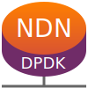

# NDN-DPDK: High-Speed Named Data Networking Forwarder

NDN-DPDK is a set of high-speed [Named Data Networking (NDN)](https://named-data.net/) programs developed with the [Data Plane Development Kit (DPDK)](https://www.dpdk.org/).
Included are a network forwarder and a traffic generator.

This software is developed at the [Advanced Network Technologies Division](https://www.nist.gov/itl/antd) of the [National Institute of Standards and Technology](https://www.nist.gov/).
It is in pre-release stage and will continue to be updated.

## Installation

### Requirements

* Ubuntu 18.04 or Debian 10 on *amd64* architecture
* Required APT packages: `build-essential clang-8 curl git libc6-dev-i386 libelf-dev libnuma-dev libssl-dev liburcu-dev pkg-config python3-distutils sudo`
* Optional APT packages: `clang-format-8 doxygen yamllint`
  (see "other build targets" for an explanation)
* [pip](https://pip.pypa.io/en/stable/installing/) and `sudo pip install -U meson ninja`
* [Intel Multi-Buffer Crypto for IPsec Library](https://github.com/intel/intel-ipsec-mb) v0.54
* DPDK 20.08, configured with `meson -Dtests=false --libdir=lib build`
* SPDK 20.07, configured with `./configure --enable-debug --disable-tests --with-shared --with-dpdk=/usr/local --without-vhost --without-isal --without-fuse`
* [ubpf](https://github.com/iovisor/ubpf/tree/089f6279752adfb01386600d119913403ed326ee/vm) library, installed to `/usr/local`
* Go 1.15 or newer
* Node.js 14.x
* [jsonrpc2client](https://github.com/powerman/rpc-codec/releases) 1.1.3 or newer, installed to `/usr/local/bin/jsonrpc2client`
* Note: you can look at the [`Dockerfile`](Dockerfile) to see how to install the dependencies.

### Build steps

1. Clone the repository.
2. Execute `npm install` to download NPM dependencies.
3. Execute `make` to compile the project.
4. Execute `sudo make install` to install the programs to `/usr/local`, and `sudo make uninstall` to uninstall them.

### Other build targets

* Execute `make godeps` to build C objects and generate certain Go source files.
* Execute `make gopkg` to build all Go packages.
* Execute `make test` to run all unit tests, or `mk/gotest.sh <PKG>` to run the tests for a given package.
* Execute `make schema` to build JSON schema.
* Execute `make doxygen` to build C documentation (requires the `doxygen` package).
* To view Go documentation, execute `godoc &` and access the website on port 6060.
  You may need to install [godoc](https://pkg.go.dev/golang.org/x/tools/cmd/godoc?tab=doc) command: `sudo GO111MODULE=off GOBIN=$(go env GOROOT)/bin $(which go) get -u golang.org/x/tools/cmd/godoc`
* Execute `make lint` to fix code style issues before committing (requires the `clang-format-8` and `yamllint` packages).
* To select release mode that disables assertions and verbose logging in C code, prepend `RELEASE=1` to the `make` command.
  You must run `make clean` when switching between debug and release modes.
* C code other than strategy is compiled with `gcc` by default; you can override this by setting the `CC` environment variable.
* Strategy code is compiled with `clang-8` by default; you can override this by setting the `BPFCC` environment variable.

### Docker packaging

1. Build the image: `docker build -t ndn-dpdk .`
2. Launch a container in privileged mode: `docker run --rm -it --privileged --network host ndn-dpdk`
3. Setup the environment inside the container: `mkdir /mnt/huge1G && mount -t hugetlbfs nodev /mnt/huge1G -o pagesize=1G && export PATH=$PATH:/usr/local/go/bin`

## Code Organization

* [ndn](ndn): NDN library in pure Go.
* [mk](mk): build helper scripts.
* [csrc](csrc): C source code.
* [js](js): TypeScript source code.
* [core](core): common shared code.
* [dpdk](dpdk): Go bindings for DPDK and SPDK.
* [ndni](ndni): NDN packet representation for internal use.
* [iface](iface): network interfaces.
* [container](container): data structures.
* [strategy](strategy): forwarding strategy BPF programs.
* [app](app): applications, including the forwarder dataplane.
* [cmd](cmd): executables.
